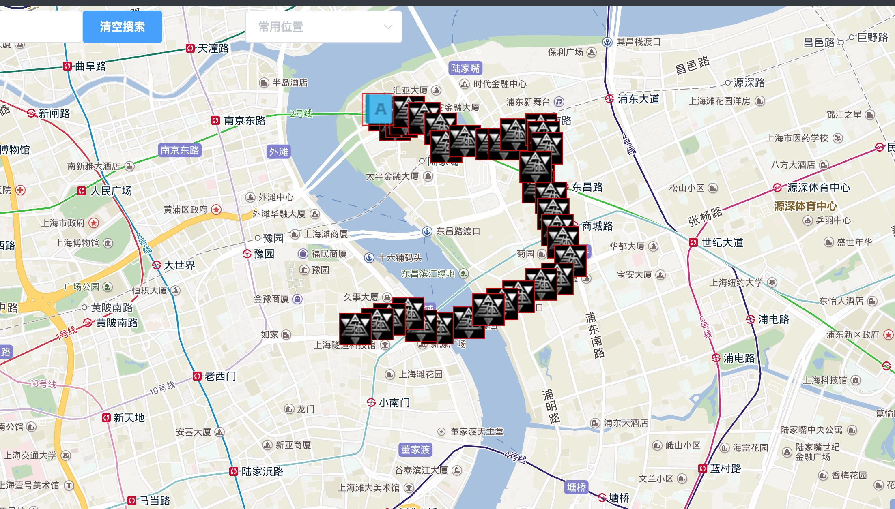

# 地图记忆(Map Memory)
I've always had trouble managing my notes, because there are too many categories, there are dozens of solutions out there, but this one is special, it correlates geo location with notebook, which I think is quite interesting,and helps memorize things a lot. Personally I use it to take notes, write travel diary and memorize many other things.

# 欢迎贡献代码
I would like to make this an useful, easy to use and fancy to use tool, just need some more smart brains and fingers

### 开发群：796903274

here's the link: www.ditujiyi.com
